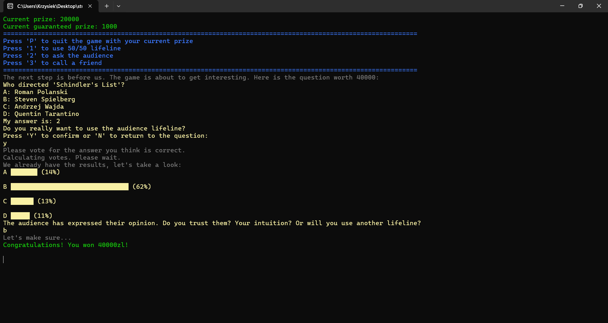
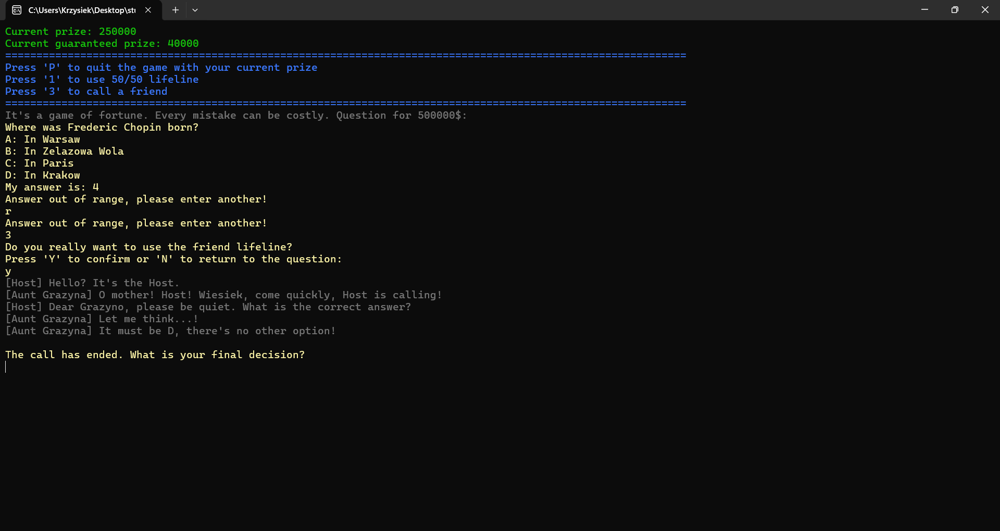
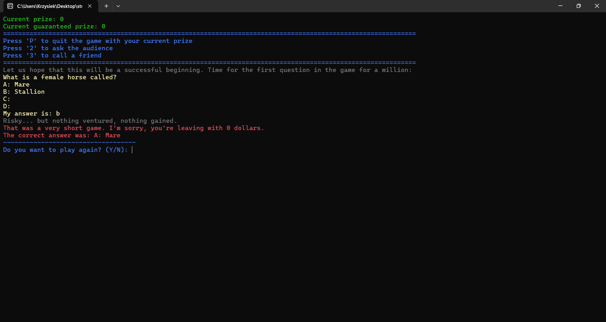
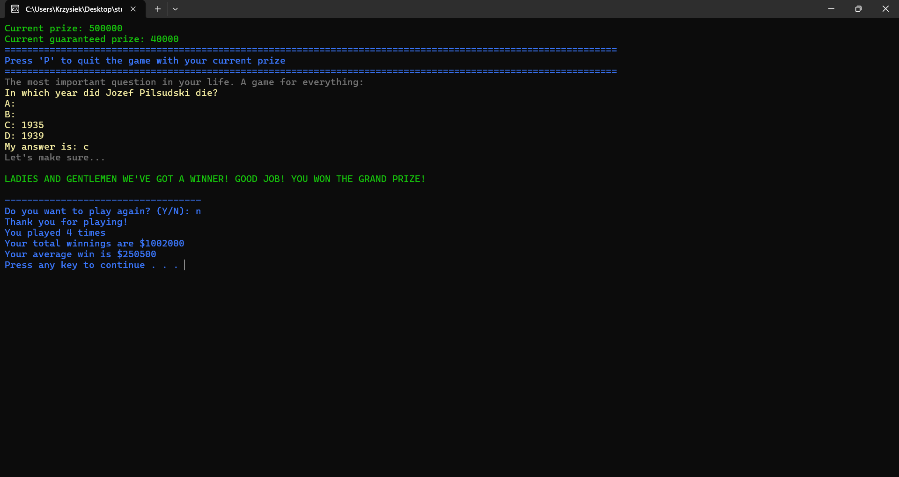

# Who Wants To Be A Millionaire - console game
## Game Preview





## Technicalities
Concepts: Multi-file architecture, control flow, input validation, struct data management, probability simulation

Contains: 
1. `millionaire.cpp` - main file
2. `game.cpp` - main game loop and core mechanics
3. `functions.cpp` & `functions.h` - UI elements, game states, and helper functions
4. `lifelines.cpp` & `lifelines.h` - logic and probability simulation for lifelines
5. `questions.h` - local database of questions categorized by difficulty

## Features
A procedural C implementation of the classic TV show "Who Wants to Be a Millionaire".

The program is a fully playable text-based game designed for the Windows console, utilizing the `<windows.h>` library for dynamic, colored text formatting to enhance the UX.

Features a local database of about 300 questions divided into three difficulty tiers (easy, medium, hard). The game uses a randomization algorithm with a strict duplicate prevention mechanism to ensure a unique playthrough every time.

Includes three fully functional lifelines (50/50, Ask the Audience, Phone a Friend). Each lifeline utilizes bespoke probability algorithms to simulate realistic, unpredictable outcomes. For instance, the "Phone a Friend" lifeline randomly selects a persona (e.g., an expert vs. a clueless uncle), which dynamically impacts the accuracy of the hint.

The code implements robust input validation and buffer clearing mechanisms, ensuring the program handles unexpected or invalid user inputs safely without crashing or entering infinite loops.

## Future improvements
**High Score System:** Adding file I/O operations to save and load the best scores from a local `.txt` file.

**External Database:** Transitioning the question pool from hardcoded C-structs to dynamically loaded JSON or CSV files for easier scalability and content updates.

## Additional info
All in-game questions and host/lifeline conversations were prepared with the assistance of AI to ensure linguistic correctness and a diverse range of content. The program was originally written in Polish so there may be some contents not translated to English.

## How to run
Because the program uses Windows-specific libraries (`<windows.h>`) for console text coloring, it is intended to be compiled and executed in a Windows environment.

1. Compile the code using any standard C++ compiler (e.g., MSVC, MinGW).
2. Run the executable from the terminal:
```bash
./millionaire.exe

